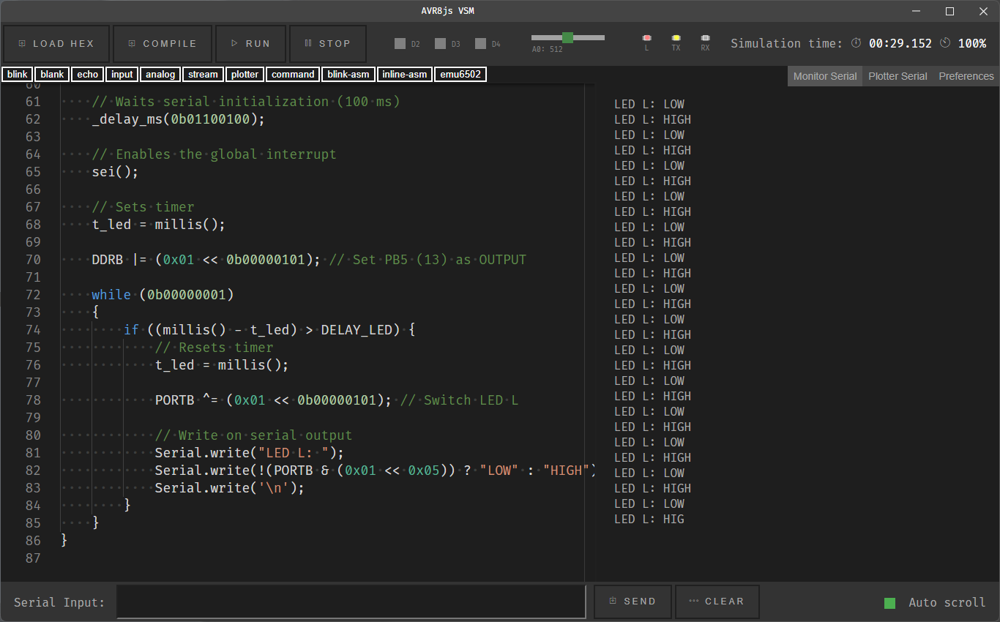

# AVR8js Virtual Serial Monitor

An AVR8 simulator with serial monitor

[AVR8js](https://github.com/wokwi/avr8js) + [Electron](https://github.com/electron/electron) + [Monaco Editor](https://github.com/microsoft/monaco-editor)

To run this application:

1. Install dependencies: `npm install`
2. Build with TypeScript: `npm run build`
3. Start the app: `npm start`

To run dev:

1. Run dev: `npm run dev`

## License

AVR8js are released under the [MIT license](https://github.com/wokwi/wokwi-elements/blob/master/LICENSE).

Electron are released under the [MIT license](https://github.com/electron/electron/blob/master/LICENSE)
